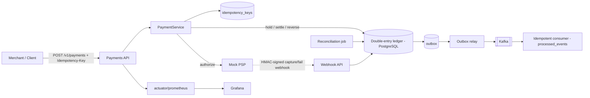

# Payments + Double-Entry Wallet Service

A production-grade payments backend: a **double-entry ledger** as the source of truth,
**idempotent** payment APIs, a **hold → settle saga**, **async capture via signed webhooks**,
**refunds**, a **transactional outbox → Kafka** with idempotent consumers, a **reconciliation**
job, and **Prometheus/Grafana** observability.

**Stack:** Java 21 (virtual threads) · Spring Boot 3.4 · PostgreSQL · Redis · Kafka · Docker

Design docs: [docs/PLAN.md](docs/PLAN.md) · [docs/HLD.md](docs/HLD.md) · [docs/LLD.md](docs/LLD.md)

---

## Architecture



Money moves between typed accounts (`USER_WALLET`, `MERCHANT_PAYABLE`, `PSP_SUSPENSE`,
`FEE_INCOME`). Every transfer is a balanced set of postings (Σ = 0), enforced in code **and** by a
deferred Postgres constraint trigger. Balances are a materialized, continuously-reconciled cache.

## Run it (no JDK needed — everything builds in Docker)

```bash
docker compose up --build
curl localhost:8080/actuator/health         # {"status":"UP"}
```

| URL | What |
|-----|------|
| `http://localhost:8080` | the API |
| `http://localhost:8080/actuator/prometheus` | metrics |
| `http://localhost:9090` | Prometheus |
| `http://localhost:3000` | Grafana (anonymous admin; Prometheus datasource pre-provisioned) |

Stop: `docker compose down -v`.

## API

```
POST /v1/payments                  Idempotency-Key: <uuid>   -> 201 | 409 | 422
GET  /v1/payments/{id}
POST /v1/payments/{id}/refunds     Idempotency-Key: <uuid>   -> 201 | 422
POST /v1/webhooks/psp              X-PSP-Signature: <hmac>   -> 200 | 401
```

## Design highlights

- **Idempotency** — durable `(merchant, key)` claim; concurrent duplicates conflict, completed ones
  replay. Race-safe via a unique constraint.
- **Double-entry ledger** — immutable postings; balances maintained under `SELECT … FOR UPDATE`
  with a non-negative guard (no oversell); net-zero enforced by a deferred trigger.
- **Saga** — `hold → authorize → settle | reverse`, with the PSP call outside any DB transaction.
- **Async capture** — `authorize` may return `PENDING`; a signed (`HMAC-SHA256`) webhook captures or
  fails the held payment, idempotent on `psp_event_id` plus a state guard.
- **Transactional outbox** — events written in the same tx as the state change; a relay publishes to
  Kafka (`FOR UPDATE SKIP LOCKED`); consumers dedupe → effectively exactly-once.
- **Refunds** — full/partial, idempotent, over-refund guarded.
- **Reconciliation** — asserts `Σdebits = Σcredits` and balance == Σ postings; expires stale holds.

## Observability

Micrometer → Prometheus (`/actuator/prometheus`): `payments_created_total{outcome}`,
`http_server_requests_seconds` (p95/p99 histograms), and the **`ledger_imbalance`** gauge (must read
0). Grafana is wired to Prometheus out of the box.

## Load test

```bash
NET=$(docker network ls --format '{{.Name}}' | grep -i payments | grep -i default | head -1)
docker run --rm --network "$NET" -v "$PWD/load":/scripts:ro \
  -e BASE_URL=http://app:8080 grafana/k6 run /scripts/payments.js
```

**Measured (local, single instance on Rancher Desktop — Docker-in-VM on an Apple-Silicon Mac):**
50s ramping load, 20 VUs → **3,691 payments, 0 failures (100% `201`)**, **73.8 payments/s**,
latency **median 214 ms · p95 452 ms · p99 614 ms · max 1.09 s**. Every request does an idempotency
claim + a multi-posting double-entry transfer under row locks + an outbox write, so this is end-to-end
write throughput, not a read benchmark.

## Tests

Run against Postgres (Testcontainers, or an external DB via `EXTERNAL_DB_URL`):

```bash
gradle test     # JDK 21 + Gradle 8.11.x
```

## Milestones

| M | Scope | Status |
|---|-------|--------|
| M0 | Skeleton: Dockerized stack, Flyway schema, double-entry trigger | ✅ |
| M1 | Ledger balance maintenance + 100-parallel oversell test | ✅ |
| M2 | Payments + idempotency + hold→settle saga | ✅ |
| M3 | Transactional outbox → Kafka + idempotent consumer | ✅ |
| M4 | Async capture via HMAC-signed webhooks | ✅ |
| M5 | Refunds + reconciliation | ✅ |
| M6 | Observability + k6 load test + this README | ✅ |
